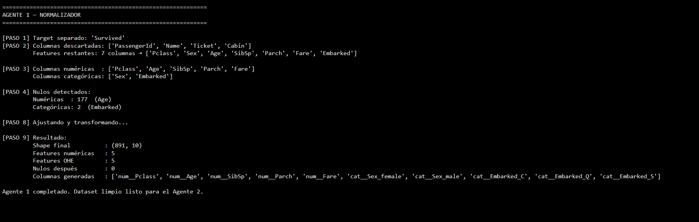
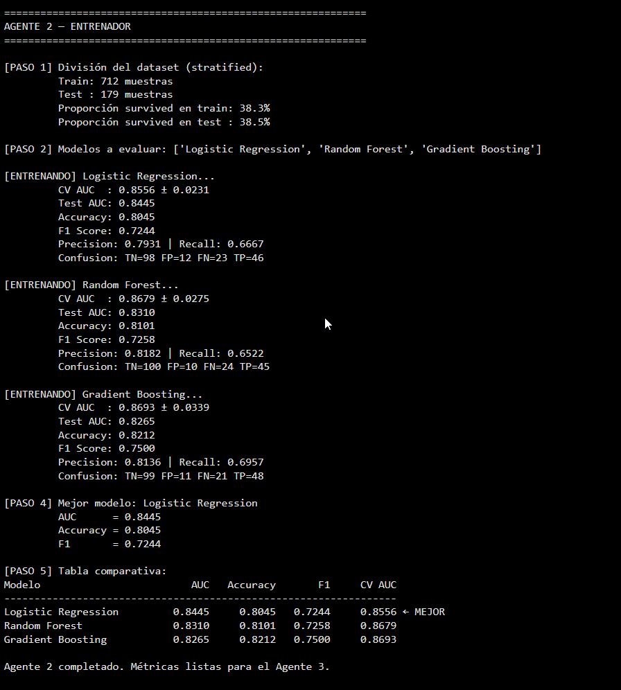

# Clase 08/06/2026 - Pipeline de Machine Learning — Titanic Dataset

Notebook de Google Colab con un pipeline de clasificacion basado
en 3 agentes para predecir la supervivencia de pasajeros del Titanic.

**Dataset:** [Titanic Dataset — Kaggle](https://www.kaggle.com/datasets/yasserh/titanic-dataset)  

---

---

## Resultados

El Agente 2 entrenó 3 modelos y los comparó por AUC:

| Modelo | AUC Test | Accuracy | F1 |
|--------|----------|----------|----|
| **Logistic Regression** | **0.8445** | 0.8045 | 0.7244 |
| Random Forest | 0.8310 | 0.8101 | 0.7258 |
| Gradient Boosting | 0.8265 | 0.8212 | 0.7500 |

El mejor fue Logistic Regression con AUC 0.8445. Curiosamente
Gradient Boosting tuvo mejor accuracy y F1 pero peor AUC, por eso
no fue seleccionado.

<!-- agregar capturas del agente 3 respondiendo preguntas -->
<!--  -->

---

## Cambios y problemas que surgieron

- El primer modelo que probé para el Agente 3 fue RoBERTa (QA
  extractivo) pero solo copiaba fragmentos del contexto, no
  generaba respuestas propias.

- Después probé con Flan-T5 (base y large) pero con contextos
  largos respondía cosas que no tenían nada que ver con la pregunta.

- Al final migré a Qwen2.5-1.5B-Instruct que es un modelo de chat
  y funciona mucho mejor para este tipo de preguntas abiertas.

- Tuve que fijar `transformers==4.41.0` porque en versiones mas
  nuevas la tarea `question-answering` no estaba disponible.

- El Agente 3 no podía responder preguntas demograficas (ej:
  porcentaje de mujeres) porque esa info no estaba en el contexto.
  Lo resolvi calculando esas estadisticas aparte con pandas y
  agregandolas al contexto antes de pasarselo al modelo.

- `apply_chat_template` me dio un error en `model.generate()` porque
  devolvía un BatchEncoding en lugar de un tensor. Lo solucione
  separando la tokenizacion en dos pasos.

- Separe el Agente 3 en dos bloques (carga del modelo / preguntas)
  para no tener que recargar 3GB cada vez que queria probar algo.

  ## Capturas del Agente 3

- Captura Output del agente 1

- Captura Output del agente 2

- Captura Output del agente 3

